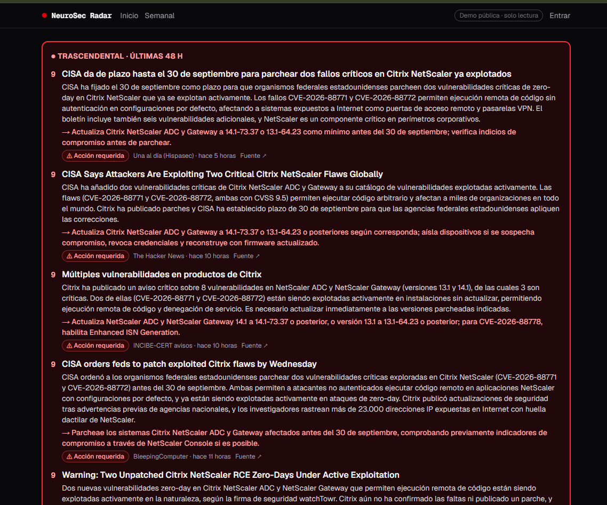

## Qué hace

Reúne en un solo sitio las novedades de **ciberseguridad**, de **inteligencia artificial** y de lo que
pasa entre las dos: prompt injection, seguridad de modelos de lenguaje, IA ofensiva y defensiva…
Cada noticia llega resumida en español, con su importancia del 1 al 10 y el enlace a la fuente original.

Lo hice para estar al día sin tener que visitar decenas de webs cada día. Tiene una
[demo pública](https://neurosec-radar.vercel.app) de solo lectura que cualquiera puede ver sin cuenta.

## Cómo funciona

1. **Recogida.** Un recolector en Python consulta cada 30 minutos 30 fuentes:
   - Medios de ciberseguridad e IA, en inglés y en español (Una al día, INCIBE-CERT, BleepingComputer…).
   - El catálogo de vulnerabilidades explotadas de CISA (KEV).
   - Los CVE críticos de la NVD.
   - Los artículos de investigación nuevos de arXiv que tratan de IA y seguridad.
2. **Limpieza.** Descarta duplicados por URL y por títulos parecidos. Cuando varios medios hablan del mismo
   CVE, los agrupa en una sola noticia.
3. **Análisis con IA.** Claude Haiku lee cada artículo y devuelve un JSON con la categoría, la importancia,
   el resumen en español y los CVE mencionados. Uso la API de lotes (Message Batches), que cuesta la mitad.
4. **Web.** Una aplicación en Next.js muestra el feed con búsqueda y filtros. Arriba van los destacados
   y un aviso fijo para lo trascendental.
5. **Chat con la IA.** En cada noticia se le pueden hacer preguntas a Claude, que responde con la noticia
   como contexto.
6. **Resumen semanal.** Cada lunes la IA escribe un resumen de la semana: lo más importante, las noticias
   por tema y las tendencias.

Las notas, los favoritos, lo leído y el chat con mi propia clave son solo para mí. En la demo, quien quiera
usar el chat pone **su propia API key de Anthropic**, así que su uso no me cuesta nada.

## Decisiones de las que he aprendido

- **La IA aporta hechos; la decisión la toma el código.** Al principio le pedía a la IA que dijera si una
  noticia necesitaba **«Acción requerida»**, y marcaba de más. Ahora solo me dice qué producto está
  afectado, si se está explotando y qué hay que hacer. Una regla en el código decide con eso, y si el
  CVE está en el catálogo de CISA, eso manda sobre lo que diga la IA.
- **Una puntuación CVSS alta no significa que la noticia sea importante.** He ajustado las instrucciones a la IA
  para que no confunda la gravedad técnica de un fallo con su importancia real.
- **Programación fiable.** La programación de GitHub Actions se saltaba ejecuciones. Por eso el recolector
  lo lanza ahora un cron de Supabase, que llama a la API de GitHub cada 30 minutos.
- **Barato.** La primera semana, analizar 861 noticias costó unos 1,5 USD de IA. Supabase, Vercel y
  GitHub Actions están en sus planes gratuitos.

## Seguridad

Es un repositorio público y una web pública que procesa contenido no fiable (de hecho, recoge noticias
*sobre* prompt injection), así que la seguridad es parte del diseño:

- **Base de datos.** Todas las tablas tienen Row Level Security. Los visitantes de la demo solo pueden
  leer las columnas que se muestran y nunca las tablas personales (notas, lo leído, chats).
- **Contenido no fiable.** El texto de las noticias llega a la IA marcado como datos, la IA no tiene
  herramientas y su respuesta se valida contra un esquema JSON antes de guardarla. Las respuestas del
  chat se muestran como texto, nunca como HTML.
- **La API key de los visitantes.** Se queda en su navegador, que habla directamente con Anthropic: nunca
  pasa por mi servidor ni se guarda en la base de datos, y sus conversaciones no se almacenan.
- **Secretos.** Las claves están en GitHub Secrets, en Vercel y en Supabase Vault; nunca en el código.
